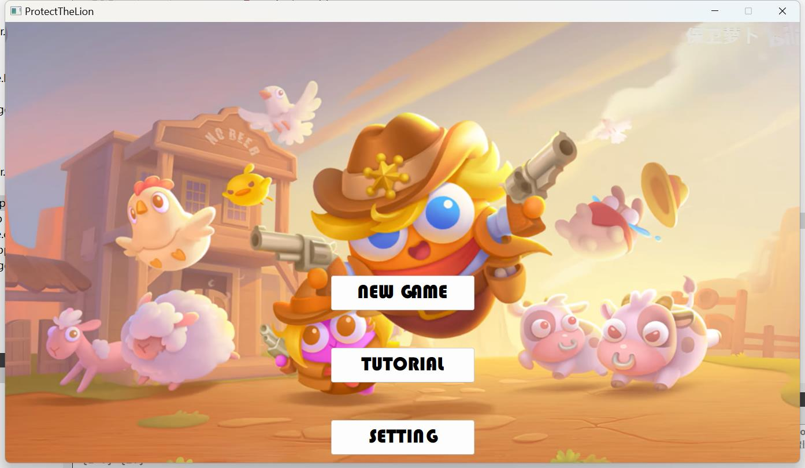
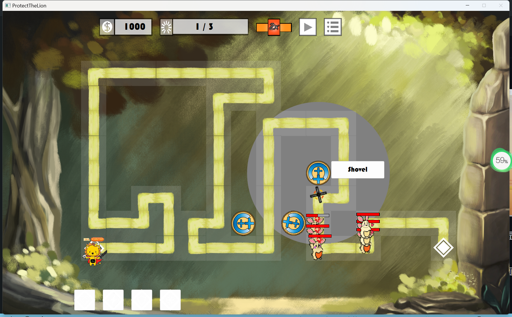

# ProtectTheLion
这是北京大学2023春程序设计实习Qt大作业的代码仓库  
[点此可以进入视频讲解](README_img/intro.mp4)

## 一、项目介绍
“保卫攻城狮”是一个塔防游戏，游戏场景有一条路连接了刷怪点和攻城狮，玩家需要在路的沿途种植炮台以阻止怪物到达攻城狮处。攻城狮是一个带有GPA4.00的吉祥物，而怪物将会减少攻城狮的GPA，当GPA减少至0游戏结束。

## 二、主要功能
进入主界面有三个操作按钮:  

  

点击NEW GAME将开始新的游戏，点击TUTORIAL将显示教程，点击SETTING将进入游戏设置。  

进入NEW GAME，首先会有攻城狮倒计时的开场动画，然后进入游戏环节。游戏中有一条曲折的路，定时刷出来的怪物沿着路前进，单击路旁的空地会跳出种植菜单以种植炮台，炮台一旦种下将会自动瞄准范围内的怪物进行攻击(点击格子将会有聚焦框表明该格子当前被选中，点击种植上的炮台将会显示攻击范围和移除按钮)

屏幕上方从左到右依次显示了金币框、进度条、速度按钮、暂停按钮、退出按钮。游戏视图有3档速度切换模式，暂停按钮可以让游戏停下；屏幕下方是四种不同的魔法技术，分别是生命技能（给攻城狮增加GPA），加速技能（全体炮台加速），冰冻技能（全体怪物冰冻），轰炸技能（全体怪物消失）
  
　　

当全部波数的怪物都被消灭或者工程师GPA减到０之后，游戏将结束并回到主界面。

## 三、主要类的实现细节

### 1. 游戏主战场：mainpage类  
 
包括如下场景相关内容：  

- QLabel* GPABar;
- QLabel* moneyBar;
- QLabel* focusPic;
- QLabel* rangePic;
- QLabel* theLionPic;
- QLabel* progressBar;
- QPushButton* backBar;
- QPushButton* speedBar;
- QPushButton* stopBar;
- QLabel* backgroundpic;
- QPushButton* iceBar;
- QPushButton* boomBar;
- QPushButton* cureBar;
- QPushButton* cheerBar;

游戏控制工具：

- QTimer* timer;
- QTimer* waveGener;
- QGraphicsView* view;
- QGraphicsScene scene;
- QList<Tower*> allPlants;
- QList<monster*> allMons;
- QThread workerThread;
- QWidget* planting_window;    //种植菜单
- QWidget* upgrading_window;  //升级菜单
- bool notEmpty[grid_h_num][grid_w_num]{};
- Tower* isPlant[grid_h_num][grid_w_num]{};
- std::pair<int,int> stepdir[grid_h_num][grid_w_num]{};

场景参数：

- int left,width;
- const int fps = 23;
- const int labeltop = 10;
- const int skillsize = 60;
- const int buttonsize = 50;
- const int labelstart = 100;
- const int labelpadding = 20;
- static startPage* rootPage;
- const int padding_left = 150;
- static const int grid_l = 70;
- static const int grid_h_num = 10;
- static const int grid_w_num = 16;
- const int padding_bottom = skillsize+20;
- const int padding_top = labeltop*2+buttonsize;
- const int window_width = padding_left*2+grid_w_num * grid_l;
- const int window_height = padding_top+padding_bottom+grid_h_num * grid_l;

游戏参数：

- int speed = 1;
- int money = 1000;
- int curWave = 0;
- int totalWave = 3;
- int totalGPA = 9;
- int newgenermons = 0;
- int monsWave[100];
- int monsHP[100][100];
- int monsType[100][100];
- int monsSpeed[100][100];
- int monsScale[100][100];
- std::pair<int,int> focusPos;
- std::pair<int,int> startpos;
- std::pair<int,int> endpos;

场景布置函数
- void graphics_setting();
- void ui_setting();
- void popup_setting();
- void generate_road();
- void generate_buildings();

- void mousePressEvent(QMouseEvent* e);
QLabel* setLabel(QString url,QRect pos=QRect(-1,-1,-1,-1));
template<typename T1>
QPushButton* setButton(QString url, T1 slot, QRect pos=QRect(-1,-1,-1,-1));
- std::pair<int,int> add(std::pair<int,int> x, std::pair<int,int> y){
    return {x.first+y.first, x.second+y.second};
}

信号与槽：

- void _gameFail();
- void _gameWin();
- void frozenAll();
- void killAll();
- void cheerAll();
- void pauseGame();
- void continueGame();
- void speedChange(int muls);
- void oneWave();
- void gameFail();
- void gameWin();
- void closeAct();
- void speedAct();
- void stopAct();
- void cureAct(int);
- void bombAct();
- void iceAct();
- void cheerAct();

游戏中所有的参数都以常量或者静态成员的方式定义，方便编码过程中的构建和调整；游戏元素的位置通过代码方式创建指针来实现，而非使用ui实现。

mainpagepage的实现细节：
1. 当怪物数量为0且未达到指定波数时，开始执行生成怪物逻辑；加速逻辑、暂停逻辑/生成怪物均使用定时器控制；怪物和炮台的交互分别放在两个类的实现中。这里有个意想不到的细节：需要一个全局变量判断窗口是否已经关闭：否则游戏提前结束关闭窗口之后还会继续调用生成怪物的函数，导致程序崩溃。另一个需要注意的点是：使用定时器绑定生成单个怪物，而不要使用线程阻塞来人为制造怪物之间的间隔，后者的缺点是会让oneWave函数在很长有一段时间占有线程，这个时候很容易发生各种意外，比如游戏结束、游戏加速等等都会对函数逻辑造成很大影响而导致崩溃；而前者的实现让oneWave只在该运行的时候运行，基本不会在运行过程中发生意外，只需要在进入的时候进行判断。
2. 通过场景参数生成用代码对场景进行布置，该处封装了很多生成类工具，以便简洁的生成场景元素。（该处经过多次结构调整，最终将上百行的布置代码成功变成了简洁的十几行代码）
3. 窗口之间的切换：需要注意widget要打开关闭自动析构的功能！不然会在游戏结束后莫名其妙的弹出不知什么时候打开的窗口。
4. mainpage的善后工作：记录在场的monster和tower，在机构的时候人为析构他们，同时改变各种与游戏状态相关的全局参数；注意场景元素是不需要析构的，因为Qt内置有析构子对象的机制

### 2. 怪物类： monster类

自身参数：

- int HP;
- int type;
- int fullHP;
- double scale;
- double speed;
- mainPage* root;

- void hurt(double damage);  //被攻击

行为相关：

- int _imageNum = 0;
- static QList<QPixmap>& images()
- std::pair<int,int> nxtg;    //下一个格子
- std::pair<int,int> curd;    //当前方向
- std::pair<int,int> curg;    //当前格子
- std::pair<int,int> endg;    //终点格子
- const std::pair<int,int>* _dir; //全局移动方向
- const std::pair<int,int> dir(std::pair<int,int>);

- static int monsNum;
- static const int DATA_TYPE = 128;
- static const int MONSTER_TYPE = 127;
- static std::map<monster*,bool> memoryExisted;

- virtual void advance(int phase) override;
- virtual QRectF boundingRect() const override;
- virtual void paint(QPainter *painter, const QStyleOptionGraphicsItem *option, QWidget *widget = Q_NULLPTR) override;
- std::pair<int,int> add(std::pair<int,int> x, std::pair<int,int> y){
  return {x.first+y.first, x.second+y.second};
}

- void newWave();
- void arriveEnd(int);

怪物相关的逻辑是：  

1. 沿着道路前进。mainpage生成道路的时候记录下每个格子的转移方向，monster从mainpage中读取信息从而知道当前格子的下一步转移方向。这里需要注意的一点是：只有monster走到格子中心的时候才会转方向，需要记录上一步和下一步的格子来判断走到了格子的哪个位置；
2. 析构逻辑：当monster的血量小于0时自动析构，当monster到达工程师的格子时也会自动析构。这里要格外注意的一点是：由于monster和其他函数有交互，所以需要在monster析构后单独进行记录（memoryExisted成员），以告诉其他对象被自己析构掉了，否则会出现segmentation fault（该问题会出现在炮台打死monster的下一次攻击处）；
3. 动画设置：monster在移动中有行走动画，这是通过按帧更新的方式实现的；monster死亡后有死亡动画，这通过延时析构的方式实现；

### 3. 炮塔类：bottle_tower类

bottle_tower继承了tower基类，拥有bottle类，主要设计均体现在成员函数的行为上面：

1. 自动攻击怪物逻辑：首先通过renewTarget方法得到攻击对象，根据target和自身角度得到旋转夹角和方向，如果需要旋转则按照方向转动小角度，当角度对齐且攻击间隔达到设定时，沿着该角度发射一个bottle。这个简单的逻辑背后有一个非常复杂的坑：由于多个炮台和怪物实时交互，在这个逻辑中多个地方需要进行指针析构的判定和指针置空的操作，对内存和指针的处理出乎意料的成为了这个过程中最困难的点
2. bottle攻击逻辑：给一个初速度和角度沿着该方向飞行，利用接触判定的方法进行攻击。一个小坑是：bottle对monster减血至0之后不能立刻析构monster，而需要等到monster的advance函数中析构，这是QGraphicScene的工作机制造成的（所有析构操作只能在自己的成员函数中进行），否则会被scene二次调用，即使已经removeItem了。
3. bottle_tower更新对象逻辑：首先判断是否已经有对象且对象是否存在且对象是否在攻击范围内，从而判断是否需要更新。否则，从所有monster中选择最近的那一个。
4. bottle_tower攻击动画：一个是旋转动画，让攻击变得更加流畅，实现方式如上所述。不过由于Qt提供的接口很混乱，在角度/弧度/坐标/距离之间的转换造成了很大的阻碍；一个是攻击动画，利用按帧更新的方式，在攻击时换成攻击样式，静止时换成静止样式，从而显示出攻击的样子。该处动画看似简单，在实现过程中实际上有超多需要用心设计细节的地方：如转向的速度设置既不能太快（否则可能在目标面前足有横跳）也不饿能太慢（否则可能追不上怪物）；如需要注意转向结束之后才能发射；如需要注意攻击对象消失是要强制进行repaint（按照QGraphicsScene的更新方式，会出现攻击结束了但是没有到切换成静态图的帧数，导致在静态状态下的图片仍然是攻击样式；
5. bottle的对象更新策略：由于飞行时间并不是即时的，所以会出现飞到一半对象已经被析构的问题，所以同样需要通过memoryExisted成员判断对象是否被析构掉了，之后再引用该指针。

## 三、未来改进方向

1. 计划增加更多的炮台和怪物。该次作业仅仅实现了炮台和怪物的基本功能，但是未来打算做出更有意思的技能和交互。
2. 在动画和样式上进行改进，打磨游戏场景中的细节。
3. 改善游戏的结构和封装，增加可扩展性和可改动性。